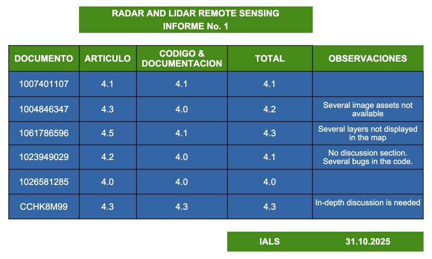
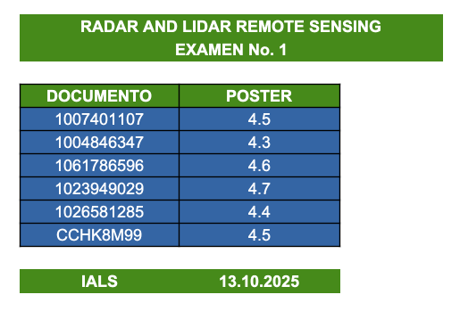

::: {.callout-important collapse=true}
## 📢 Grades

(31/10/2025)

(11/10/2025)

:::

::: {.callout-important collapse=true}
## 📢 Syllabus

(28/08/2025)

- [🗓️ Know the syllabus here!](/2025/syllabus.qmd)

:::

# 🧑🏻‍🏫 Our Team

::: {.panel-tabset}
## Course Convenor

{fig-align="left" fig-alt="Photo of IVAN LIZARAZO" style="object-fit: cover;width:6em;height:6em;border-radius: 50%;"}  
**IVAN LIZARAZO**  
_ASSOCIATE PROFESSOR_  
UNAL</a> 
📧 [ializarazos@unal.edu.co](mailto:)

Office Hours: 

- When: Fridays morning
- Where: Oficina 333
- How to book: via e-mail

## Teaching Staff

**IALS**

:::

# 📍 Dates - Location

Thursdays 2pm-6pm at SALON 103
